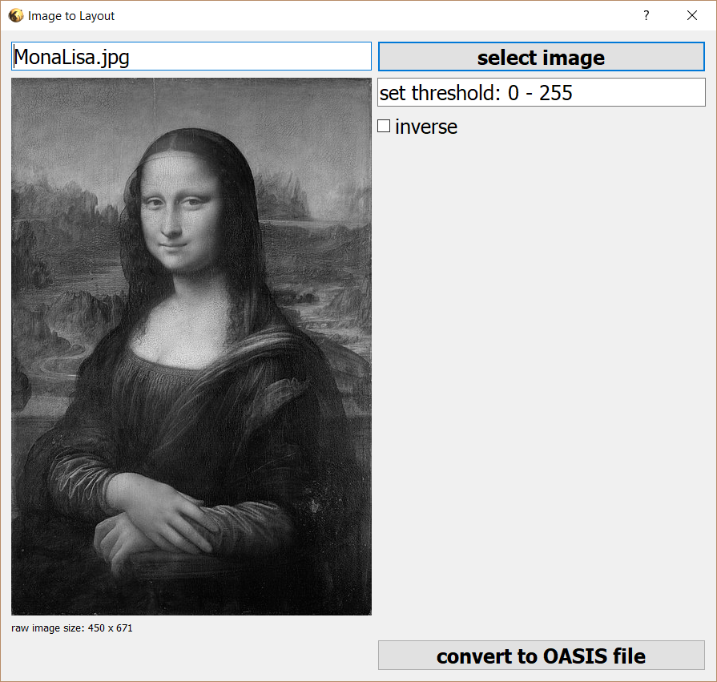

# Image to Oasis

---
- In KLayout's Macro development enviroment, create a new empty Python Macro.
- Copy all text inside image_to_oasis.py to the Python Macro.
- Click "Run current script" button in the Marco development enviroment.
- In the pop up GUI, click "select image" button to select the image you want to convert. Please be noticed all the images will be converted to grayscale images.
- Set the conversion threshold. If "**inverse**" is not checked, only the pixel with the intensity higher than the threshold will be set to polygon. If "**inverse**" is checked, only the pixel with the intensity lower than the threshold will be set to polygon.

